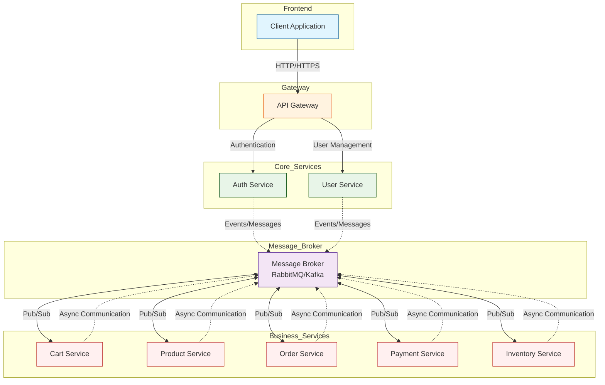

# 📦 product-platform


---

A microservices platform built in Java and Spring Boot, organized with various services representing common functionalities in e-commerce applications (such as login service, shopping cart, products, orders, etc.). This project serves both as a study and as a basis for developing distributed architectures with Spring Boot and communication between services.

---

## Overview

This repository contains microservices that implement separate functionalities independently, using:

- Java with Spring Boot
- Microservices organized by domain
- PostgreSQL as a database
- Kafka for communication between services
- Architecture designed for scalability and maintenance.

---

## Services and Features

| Serviço | Descrição |
|---------|-----------|
| `auth-service` | Authentication validation (test) |
| `cart-service` | Shopping cart operations |
| `order-service` | Order management |
| `product-service` | CRUD of products |
| `user-service` | User testing / validations |
| `payment-service` |   |
| ìnventory-service`  |    |  

Each service is a standalone Spring Boot project, with its own business logic and configuration.

---

## Technologies

The project uses the following main technologies:

- 🔹 **Java 17+**
- 🔹 **Spring Boot** (Spring Web, Spring Data, etc.)
- 🔹 **PostgreSQL**
- 🔹 **Apache Kafka**
- 🔹 **Docker**
- 🔹 **Gradle**

---

## How to Run the Project

**Clone the repository**
```bash
git clone https://github.com/KleberVales/product-platform.git
cd product-platform
```

## Flowchart




--- 

Kleber Vales

Java & Spring Software Engineer

Cloud | DevOps | Microservices | Docker | Kubernetes | Git/Github | 


